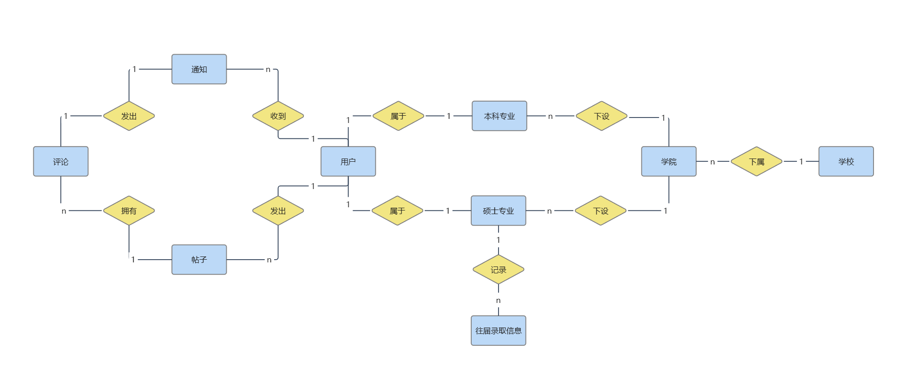
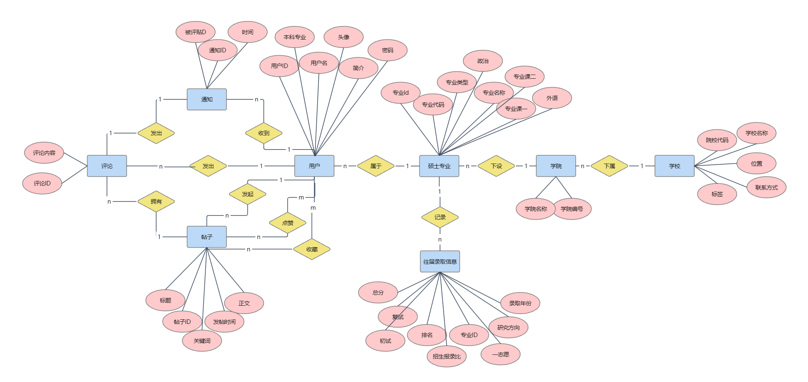

## 一、组员名单
* 组长：金楷茗
* 组员：王怡萱
* 组员：应卓航
## 二、需求分析
### 1.1 需求描述
&emsp;&emsp;&ensp;随着当下大学生越来越意识到攻读研究生的重要性，考研已经成为了时下的一个热门话题。根据教育部官方数据，自2015年以来，我国硕士研究生报名人数屡创新高，2019年达到290万，2020年首次突破300万，而在刚刚过去的2022年，报考人数更是达到457万，再度创下历史新高。
&emsp;&emsp;&ensp;面对持续不退的考研热度，每年也同样有很多北航的学生在积极地备战研究生入学考试。然而考研与大家都很熟悉的高考不同，考研的流程、数据等都不似高考那样清晰易懂、透明公开，并且在大学也不会像高中一样有老师引领着考研。我们关注到，其实有很多学生虽然定下了考研的目标，但并不知道考研的具体流程，也不知道该如何选择适合自己的学校、转业。
&emsp;&emsp;&ensp;基于如上背景，我们决定设计出一个针对于北航同学的考研指南网站，旨在帮助同学们更方便地获取信息，制定适宜的备考计划。
&emsp;&emsp;&ensp;
基于上述的需求分析，可以将用户分为三个角色，并且对各个角色进行单独的分析，见下表。
|备考学生|上岸学生|管理员|
|:----:|:----:|:----:|
|获取学校数据|分享考研经验|修改学校信息|
|与学长学姐交流获得经验|回答备考学生的问题|更新录取数据|
|制定备考计划|分享考研资料||
|合理选择志愿|||

### 1.2 相关功能
#### 1.2.1 普通用户相关功能
* 用户注册 
* 输入学号、用户名、密码等。如果信息合法则注册成功，反之报错
* 用户登录
* 展示个人信息，其中包括：头像、个人简介、所属学院、gpa、年级排名等
* 在主页获取自己的信息，并能修改头像，密码等信息。
* 根据需求检索学校、专业与对应的信息
* 收藏、点赞、评论帖子
* 根据帖子的tag搜索帖子
#### 1.2.2 管理员相关功能
* 管理学校信息，如每年考研结束后更新录取信息等
* 管理普通用户，对于违法的用户进行删号处理
* 管理帖子，具有删帖功能
* 管理tag，可以增加删除tag，也可以修改帖子的tag
#### 1.2.3 交流帖相关功能
* 创建帖子
* 具有标题、内容、图片、tag、评论区等属性
* 具有评论功能，并且评论下方可以跟随评论
* 帖子创建人有权力修改帖子
* 帖子应当记录发帖时间、被点赞数量等数据
#### 1.2.4 通知功能
* 用户发的帖子被点赞、评论时，需要收到通知
* 用户发的评论被点赞、评论时，需要收到通知

## 三、ER图
### 3.1 初步ER图

### 3.2 基本ER图
经过更加详细的分析和讨论以后，我们添加了属性并且删掉了一些冗余的关系。

## 四、数据库关系模式
### 4.1 数据库关系模式
#### 4.1.1 实体
***加粗部分为主码***
1. 用户
   U = {**用户ID**，用户名，密码，本科专业，头像，简介}
   D = {Str, Int}
   DOM = {DOM(用户ID)= DOM(本科专业) = Int，DOM(用户名) = DOM(用户密码) = DOM(简介) = DOM(头像) = Str}
   F = {用户ID $\rightarrow$ 用户名，用户ID $\rightarrow$ 密码，用户ID $\rightarrow$ 本科专业，用户ID $\rightarrow$ 头像，用户ID $\rightarrow$ 简介}
2. 研究生专业
   U = {**专业ID**，专业代码，专业名称，学院名称，专业类型，外语，政治，专业课1，专业课2}
   D = {Str, Int, Bool}
   DOM = {DOM(专业ID) = DOM(专业代码) = Int， DOM(专业类型) = Bool，DOM(专业名称) = DOM(学院名称) = DOM(外语) = DOM(政治) = DOM(专业课1) = DOM(专业课2) = Str}
   F = {专业ID $\rightarrow$ 专业代码，专业ID $\rightarrow$ 专业类型，专业ID $\rightarrow$ 学院名称，专业ID $\rightarrow$ 英语，专业ID $\rightarrow$ 政治，专业ID $\rightarrow$ 专业课1，专业ID $\rightarrow$ 专业课2}
   
3. 学校
   U = {**院校代码**，学校名称，位置，联系方式，标签}
   D = {Str, Int}
   DOM = {DOM(院校代码) = Int，DOM(学校名称) = Str， DOM(位置) = Str，DOM(联系方式) = Str，DOM(标签) = Str}
   F = {院校代码 $\rightarrow$ 学校名称，院校代码 $\rightarrow$ 位置，院校代码 $\rightarrow$ 联系方式，院校代码 $\rightarrow$ 标签}
4. 往届录取信息
   U = {**ID**，总分，初试，复试，排名，第一志愿，录取年份，招生报录比}
   D = {Str, Int，Float}
   DOM = {DOM(ID) = DOM(总分) = DOM(初试) = DOM(复试) = DOM(录取年份) = Int，DOM(第一志愿) = Str，DOM(招生报录比) = Float}
   F = {ID $\rightarrow$ 总分，ID $\rightarrow$ 初试，ID $\rightarrow$ 复试，ID $\rightarrow$ 排名，ID $\rightarrow$ 第一志愿，ID $\rightarrow$ 录取年份，ID $\rightarrow$ 招生报录比}
5. 帖子
   U= {**帖子ID**，标题，关键词，发帖时间，正文}
   D = {Str, Int}
   DOM = {DOM(帖子ID) = Int，DOM(标题) = DOM(关键词) = DOM(正文) = DOM(发帖时间) = Str}
   F = {帖子ID $\rightarrow$ 标题，帖子ID $\rightarrow$ 关键词，帖子ID $\rightarrow$ 发帖时间，帖子ID $\rightarrow$ 正文}
6. 评论
   U = {**评论ID**，评论内容}
   D = {Str, Int}
   DOM = {DOM(评论ID) = Int，DOM(评论内容) = Str}
   F = {评论ID $\rightarrow$ 评论内容}
7. 通知
   U = {**通知ID**，标题，内容，时间}
   D = {Str, Int} 
   DOM = {DOM(通知ID) = Int，DOM(标题) = DOM(内容) = DOM(时间) = Str}
   F = {通知ID $\rightarrow$ 标题，通知ID $\rightarrow$ 内容，时间，通知ID $\rightarrow$ 时间}

### 4.2 联系
#### 4.2.1 多对多联系
1. 帖子浏览动作(帖子-用户)
   action
   U = {帖子ID,用户ID,点赞,收藏}
   D = {N,B}
   DOM = {DOM{帖子ID} = DOM{用户ID} = N，DOM{点赞} = DOM{收藏} = B}
   F = {(评论ID,用户ID) $\rightarrow$ 其他属性}
#### 4.2.2 一对多联系
1. 发出帖子(帖子-用户)
   post
   U = {**帖子ID**，用户ID}
   D = {N}
   DOM = {DOM{帖子ID} = DOM{用户ID} = N}
2. 发起评论(评论-用户)
   comment
   U = {**评论ID**，用户ID}
   D = {N}
   DOM = {DOM{评论ID}=DOM{用户ID}=N}
3. 评论发起通知(评论-通知)
   commentNotice
   U = {**评论ID**，通知ID}
   D = {N}
   DOM = {DOM{评论ID} = DOM{通知ID} = N}
4. 通知提醒用户(通知-用户)
   noticeUser{通知ID，被评者ID}
   D = {N}
   DOM = {DOM{通知ID} = DOM{被评者ID} = N}
5. 帖子收到评论(帖子-评论)
   postComment
   U = {评论ID，帖子ID}
   D = {N}
   DOM = {DOM{评论ID} = DOM{帖子ID} = N}
6. 用户-研究生专业(用户-专业)
   userMajor
   U = {用户ID，专业ID}
   D = {N}
   DOM = {DOM{用户ID} = DOM{专业ID} = N}
7. 录取信息-专业()
   infoMajor
   U = {录取信息ID 专业ID}
   D = {N}
   DOM = {DOM{录取信息ID} = DOM{专业ID} = N}
8. 专业-学校()
   majorSchool
   U = {{专业代码,院校代码},专业ID}
   D = {N,STR}
   DOM = {DOM{评论ID} = DOM{专业代码} = DOM{院校代码} = N}
   

## 五、成员分工
* 金楷茗：后端开发
* 王怡萱：前后端衔接+部分后端开发
* 应卓航：前端开发

